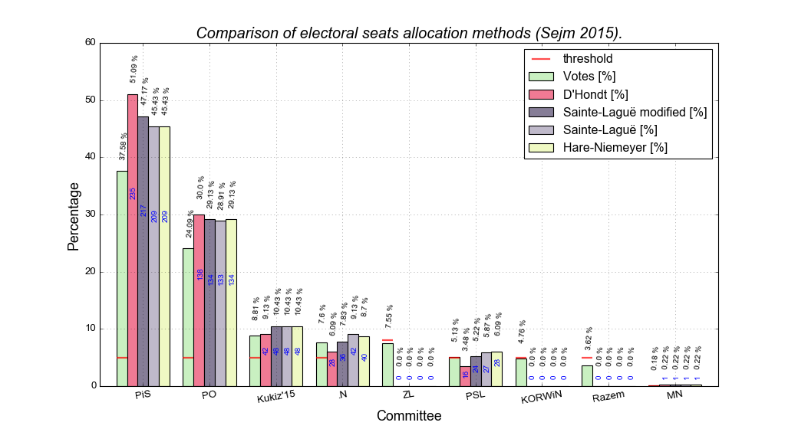
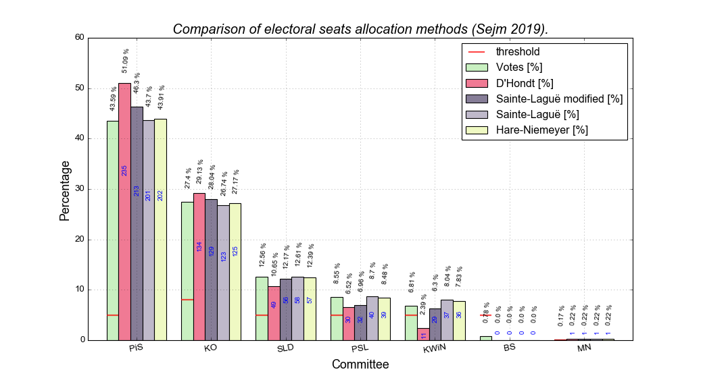

<h1 style="text-align: center;">Comparison of different methods for electoral seats allocation.</h1>

###### 
(Calculations are based on the result of [Polish Sejm elections](https://wybory.gov.pl/sejmsenat2019/pl/wyniki/sejm/pl), that took place in 2019.)

*The following methods are compared to each other:*

* [D'Hondt method](https://en.wikipedia.org/wiki/D%27Hondt_method).
* [Hare-Niemeyer method](https://en.wikipedia.org/wiki/Largest_remainder_method).
* [Sainte-Laguë method](https://en.wikipedia.org/wiki/Webster/Sainte-Lagu%C3%AB_method).
* [The modified Sainte-Laguë method](https://en.wikipedia.org/wiki/Webster/Sainte-Lagu%C3%AB_method#Modified_Sainte-Lagu%C3%AB_method).

----

You can take a look at the **elections.html** or run the **elections.ipynb** notebook yourself.

If you choose the latter and would like to reproduce the exact results, then I'd recommend using 
[Anaconda3-4.0.0](https://repo.continuum.io/archive/) environment. 
Alternatively, you can download any of Anaconda distributions and create a virtual env with *Python 3.5.4*. 
    
    $ conda create -n your_env python=3.5.4
    
    $ conda activate your_env

Then, you can install modules with versions listed in **requirements.txt**. 
To do that, the following pip command should be sufficient:

    $ pip install -r requirements.txt
    
Now, you should be good to go with:

    $ jupyter notebook

----

#### Results of Polish "Sejm" elections held in 2015 and 2019:

### Contact
If you find a bug, typo or have any questions, Please feel free to contact me.
#### abcs.luk@gmail.com

### License
[MIT](https://choosealicense.com/licenses/mit/)
